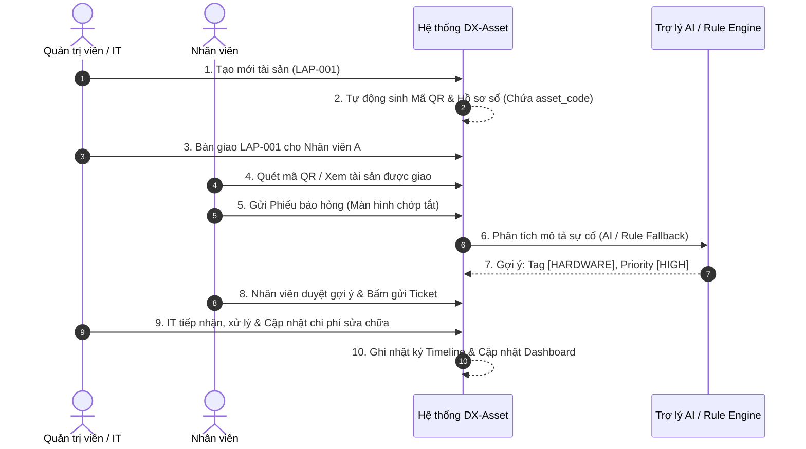
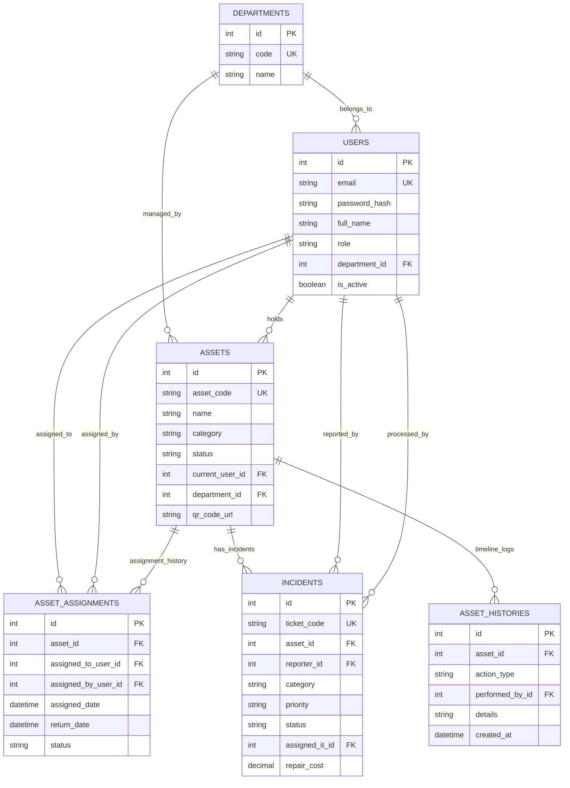

# DESIGN.md - Tài liệu Thiết kế Kiến trúc DX-Asset (Bản chuẩn hóa)

> **Dự án**: DX-Asset: Open-Source Digital Asset Lifecycle Management Platform  
> **Cuộc thi**: Phần mềm Nguồn mở OLP 2026 (Chủ đề DX-OS / DX-Lab)  
> **Đội ngũ phát triển**: Nhóm 3 sinh viên - Trường Đại học Thủ Dầu Một  

---

## 1. Product Vision (Tầm nhìn sản phẩm)

**DX-Asset** là nền tảng web mã nguồn mở quản lý tập trung toàn bộ vòng đời tài sản số và thiết bị nội bộ doanh nghiệp (laptops, desktops, monitors, printers, routers...). Sản phẩm hướng tới chuyển đổi quy trình thủ công rời rạc (Excel, giấy tờ, tin nhắn) thành một quy trình số hóa chuẩn hóa, minh bạch, có khả năng truy vết lịch sử sở hữu & bảo trì hoàn chỉnh, tích hợp Trợ lý AI hỗ trợ ra quyết định theo đúng khung kiến trúc **DX-OS**.

---

## 2. Problem Statement (Bài toán thực tế)

Trong nhiều doanh nghiệp (đặc biệt là khối SME), việc quản lý tài sản nội bộ gặp các vấn đề lớn:
1. **Quản lý rời rạc**: Dữ liệu tài sản bị phân tán qua file Excel, tin nhắn chat hoặc sổ sách.
2. **Mất truy vết lịch sử**: Không biết chính xác thiết bị đang ở đâu, ai đang sử dụng, lịch sử bàn giao hay sửa chữa trước đây như thế nào.
3. **Quy trình báo hỏng chậm trễ**: Khi thiết bị gặp sự cố, nhân viên không biết báo cho ai, phiếu hỗ trợ không được theo dõi tiến độ rõ ràng.
4. **Thiếu báo cáo quản lý**: Cấp quản lý thiếu số liệu định lượng theo thời gian thực về tổng số lượng, tình trạng thiết bị hoặc chi phí sửa chữa.

**Giải pháp của DX-Asset**: Tạo lập **Hồ sơ số tài sản (QR Asset Passport)** tập trung, kết nối toàn bộ hoạt động Cấp phát $\rightarrow$ Thu hồi $\rightarrow$ Báo hỏng $\rightarrow$ Bảo trì thành một quy trình số thống nhất.

---

## 3. Target Users (Đối tượng sử dụng)

1. **Quản trị viên (`ADMIN`)**: Quản lý người dùng, phòng ban, phân quyền và cấu hình hệ thống.
2. **Quản lý Tài sản / IT Staff (`IT_ASSET_MANAGER`)**: Quản lý danh mục tài sản, thực hiện bàn giao/thu hồi, tiếp nhận và xử lý phiếu báo hỏng sự cố.
3. **Nhân viên (`EMPLOYEE`)**: Xem thông tin tài sản được giao, quét mã QR tra cứu, gửi phiếu báo hỏng sự cố.
4. **Cấp Quản lý (`MANAGER`)**: Giám sát báo cáo thống kê tình trạng tài sản và chỉ số vận hành trên Dashboard.

---

## 4. Main Use Case (Các trường hợp sử dụng chính)

- **Định danh & Quản lý Tài sản**: Thêm mới, chỉnh sửa, vô hiệu hóa tài sản và tự động tạo mã QR định danh duy nhất.
- **Bàn giao & Thu hồi không mất lịch sử**: Bàn giao tài sản cho nhân viên/phòng ban, ghi nhận ngày bàn giao/thu hồi, bảo lưu toàn bộ bản ghi lịch sử cũ.
- **Báo hỏng & Xử lý Bảo trì**: Nhân viên gửi ticket sự cố $\rightarrow$ AI / Rule-based engine gợi ý phân loại & độ ưu tiên $\rightarrow$ IT tiếp nhận, xử lý và cập nhật chi phí.
- **Tra cứu an toàn qua QR Code**: Quét mã QR trên thiết bị chỉ chứa URL/Asset Code công khai để mở nhanh Hồ sơ tài sản (Asset Passport) mà không chứa thông tin nhạy cảm.
- **Giám sát Dashboard**: Xem biểu đồ tỷ lệ tài sản theo trạng thái, phòng ban và chi phí bảo trì thời gian thực.

---

## 5. Main Demo Workflow (Luồng trình diễn chính - 10 bước)



---

## 6. MVP Features (Chức năng thuộc phạm vi MVP)

1. **Xác thực Nội bộ & Phân quyền (Auth & RBAC)**: Đăng nhập Username/Password mã hóa Bcrypt, cấp Token JWT có thời hạn (`ACCESS_TOKEN_EXPIRE_MINUTES`), JWT Secret đọc từ biến môi trường, phân quyền tại Backend cho 4 vai trò (`ADMIN`, `IT_ASSET_MANAGER`, `EMPLOYEE`, `MANAGER`). Đăng xuất phía Frontend thực hiện xóa token khỏi bộ nhớ.
2. **Quản lý Tài sản (Asset Management)**: CRUD tài sản, phân loại category, lọc/tìm kiếm, mã tài sản duy nhất (`asset_code`), sinh mã QR chứa `asset_code`. Vô hiệu hóa tài sản bằng chuyển trạng thái (`RETIRED`/`INACTIVE`), không xóa vật lý khi đã có lịch sử.
3. **Bàn giao & Thu hồi (Assignment & Return)**: Bàn giao tài sản cho nhân viên, thu hồi về kho. Mỗi tài sản tại một thời điểm chỉ có tối đa 01 bản ghi `status = 'ACTIVE'`, toàn bộ quy trình đóng/mở bàn giao được thực hiện trong 1 Database Transaction và bảo vệ bởi PostgreSQL Partial Unique Index.
4. **Báo hỏng & Bảo trì (Incidents & Maintenance)**: Tạo ticket báo hỏng, IT tiếp nhận/chuyển trạng thái (`OPEN` $\rightarrow$ `IN_REVIEW` $\rightarrow$ `IN_PROGRESS` $\rightarrow$ `RESOLVED`), cập nhật chi phí sửa chữa.
5. **QR Asset Passport**: Quét mã QR chứa `asset_code` để mở nhanh trang chi tiết thiết bị công khai/yêu cầu đăng nhập khi thực hiện thao tác nghiệp vụ.
6. **Lịch sử Tài sản (Asset Timeline Log)**: Lưu vết toàn bộ biến động của tài sản vào bảng `asset_histories` (không xóa dữ liệu lịch sử).
7. **Dashboard Thống kê**: Hiển thị tổng số tài sản, thống kê theo trạng thái, phòng ban và các phiếu sự cố gần đây.
8. **Trợ lý AI Tùy chọn (Optional AI Assistant)**: Phân tích mô tả lỗi gợi ý Category & Priority, hỗ trợ **Rule-based Fallback** khi không có API key/lỗi mạng, tuân thủ nguyên tắc **Human-in-the-loop**.

---

## 7. Features Excluded from MVP (Tính năng CẮT BỎ khỏi MVP)

- ❌ SSO / Keycloak / OAuth2 Server / OIDC phức tạp (chỉ dùng Auth nội bộ JWT).
- ❌ Refresh Token (đã đơn giản hóa scope trong MVP).
- ❌ Hệ thống ERP toàn diện (Kế toán, Mua hàng, Lương thưởng).
- ❌ Tính toán khấu hao kế toán tài sản phức tạp.
- ❌ Quản lý nhà cung cấp (Vendor) và quy trình mua sắm (Procurement).
- ❌ Tích hợp phần cứng IoT / GPS Tracking / Tải AI Model nặng / Yêu cầu GPU.
- ❌ Nhận diện khuôn mặt hoặc sinh trắc học.
- ❌ Xây dựng ứng dụng Mobile Native (chỉ làm Web Responsive).
- ❌ AI tự động thực thi hành động không có con người kiểm duyệt (tự duyệt chi, tự thanh lý).
- ❌ Kiến trúc Microservices phức tạp (chỉ dùng Monolith tinh gọn).

---

## 8. User Roles and Permissions (Vai trò và Phân quyền)

| Chức năng | ADMIN | IT_ASSET_MANAGER | EMPLOYEE | MANAGER |
| :--- | :---: | :---: | :---: | :---: |
| Quản lý Người dùng & Phòng ban | ✅ | ❌ | ❌ | ❌ |
| Tạo / Sửa / Vô hiệu hóa Tài sản | ✅ | ✅ | ❌ | ❌ |
| Bàn giao / Thu hồi Tài sản | ✅ | ✅ | ❌ | ❌ |
| Quét QR xem Hồ sơ Tài sản | ✅ | ✅ | ✅ | ✅ |
| Xem Tài sản được giao cho mình | ✅ | ✅ | ✅ | ✅ |
| Gửi Phiếu báo hỏng (Create Ticket) | ✅ | ✅ | ✅ | ❌ |
| Tiếp nhận & Xử lý Bảo trì (IT) | ✅ | ✅ | ❌ | ❌ |
| Xem Dashboard Thống kê | ✅ | ✅ | ❌ | ✅ |

---

## 9. Database Entities & Constraints (Cơ sở dữ liệu & Ràng buộc)

### 9.1 Cơ chế Migration & Khởi tạo CSDL
- **Alembic** (kết hợp SQLAlchemy) là **cơ chế duy nhất** chịu trách nhiệm tạo schema, bảng dữ liệu và thực hiện database migration.
- `database/init.sql` (nếu sử dụng) chỉ dùng để cấu hình cơ sở dữ liệu ban đầu (ví dụ: `CREATE DATABASE dx_asset;`). Không tạo trùng lặp bảng trong `init.sql`.
- **Seed Data**: Dữ liệu khởi tạo ban đầu (User admin mặc định, phòng ban mẫu) được tách riêng thành script Python (`scripts/seed_data.py`).

### 9.2 Chính sách Bảo lưu Dữ liệu (Data Retention & Soft Delete)
- **Tuyệt đối không xóa vật lý (Hard Delete)** các bản ghi trong bảng `assets` một khi đã phát sinh bản ghi liên quan trong `asset_assignments`, `incidents` hoặc `asset_histories`.
- Vô hiệu hóa hoặc thanh lý tài sản thông qua chuyển trạng thái: `RETIRED`, `INACTIVE`, `DAMAGED`, `LOST`.
- Khóa ngoại `incidents.asset_id`, `asset_assignments.asset_id` và `asset_histories.asset_id` thiết lập quy tắc `ON DELETE RESTRICT` nhằm ngăn chặn các thao tác xóa nhầm làm mất dữ liệu lịch sử.

### 9.3 Quy tắc Bàn giao Đang hoạt động (Active Assignment Rule)
- Một tài sản tại một thời điểm chỉ được phép có **tối đa 01 bản ghi bàn giao ở trạng thái `ACTIVE`**.
- Khi thực hiện bàn giao mới:
  1. Đóng bản ghi bàn giao `ACTIVE` cũ của tài sản (nếu có): cập nhật `return_date = NOW()` và `status = 'RETURNED'`.
  2. Tạo bản ghi bàn giao mới trong `asset_assignments` với `status = 'ACTIVE'`.
  3. Cập nhật `assets.current_user_id = new_user_id` và `assets.status = 'ASSIGNED'`.
- Toàn bộ thao tác bàn giao/thu hồi được thực thi nghiêm ngặt trong **01 Database Transaction**.
- **Bảo vệ bằng Partial Unique Index (PostgreSQL)**:
  ```sql
  CREATE UNIQUE INDEX uq_active_asset_assignment 
  ON asset_assignments (asset_id) 
  WHERE status = 'ACTIVE';
  ```

### 9.4 Danh sách Tập hợp Trạng thái (Enums / Statuses)
- **Asset Status**: `IN_STOCK`, `ASSIGNED`, `IN_MAINTENANCE`, `DAMAGED`, `RETIRED`, `LOST`, `INACTIVE`
- **Assignment Status**: `ACTIVE`, `RETURNED`
- **Incident Category**: `HARDWARE`, `SOFTWARE`, `NETWORK`, `POWER`, `PHYSICAL_DAMAGE`, `OTHER`
- **Incident Priority**: `LOW`, `MEDIUM`, `HIGH`, `CRITICAL`
- **Incident Status**: `OPEN`, `IN_REVIEW`, `IN_PROGRESS`, `WAITING_FOR_INFO`, `RESOLVED`, `CLOSED`, `CANCELLED`

### 9.5 Danh sách Bảng & Ràng buộc
1. **`departments`**:
   - `id`: INTEGER, Primary Key, Auto Increment
   - `code`: VARCHAR(50), UNIQUE, NOT NULL
   - `name`: VARCHAR(100), NOT NULL
   - `description`: TEXT
   - `created_at`, `updated_at`: TIMESTAMP
2. **`users`**:
   - `id`: INTEGER, Primary Key, Auto Increment
   - `email`: VARCHAR(100), UNIQUE, NOT NULL
   - `password_hash`: VARCHAR(255), NOT NULL
   - `full_name`: VARCHAR(100), NOT NULL
   - `role`: VARCHAR(30), NOT NULL (`ADMIN`, `IT_ASSET_MANAGER`, `EMPLOYEE`, `MANAGER`)
   - `department_id`: INTEGER, Foreign Key $\rightarrow$ `departments(id)` ON DELETE SET NULL
   - `is_active`: BOOLEAN, Default TRUE
   - `created_at`, `updated_at`: TIMESTAMP
3. **`assets`**:
   - `id`: INTEGER, Primary Key, Auto Increment
   - `asset_code`: VARCHAR(50), UNIQUE, NOT NULL
   - `name`: VARCHAR(150), NOT NULL
   - `category`: VARCHAR(50), NOT NULL
   - `brand`: VARCHAR(50)
   - `model`: VARCHAR(50)
   - `serial_number`: VARCHAR(100), NULLABLE (UNIQUE nếu có)
   - `status`: VARCHAR(30), Default `'IN_STOCK'`
   - `purchase_date`: DATE
   - `warranty_expiry`: DATE
   - `current_user_id`: INTEGER, Foreign Key $\rightarrow$ `users(id)` ON DELETE SET NULL
   - `department_id`: INTEGER, Foreign Key $\rightarrow$ `departments(id)` ON DELETE SET NULL
   - `location`: VARCHAR(100)
   - `description`: TEXT
   - `qr_code_url`: VARCHAR(255)
   - `created_at`, `updated_at`: TIMESTAMP
4. **`asset_assignments`**:
   - `id`: INTEGER, Primary Key, Auto Increment
   - `asset_id`: INTEGER, Foreign Key $\rightarrow$ `assets(id)` ON DELETE RESTRICT, NOT NULL
   - `assigned_to_user_id`: INTEGER, Foreign Key $\rightarrow$ `users(id)` ON DELETE RESTRICT, NOT NULL
   - `assigned_by_user_id`: INTEGER, Foreign Key $\rightarrow$ `users(id)` ON DELETE RESTRICT, NOT NULL
   - `assigned_date`: TIMESTAMP, NOT NULL
   - `return_date`: TIMESTAMP, NULLABLE
   - `status`: VARCHAR(20), Default `'ACTIVE'` (`ACTIVE`, `RETURNED`)
   - `notes`: TEXT
   - `created_at`: TIMESTAMP
5. **`incidents`**:
   - `id`: INTEGER, Primary Key, Auto Increment
   - `ticket_code`: VARCHAR(50), UNIQUE, NOT NULL
   - `asset_id`: INTEGER, Foreign Key $\rightarrow$ `assets(id)` ON DELETE RESTRICT, NOT NULL
   - `reporter_id`: INTEGER, Foreign Key $\rightarrow$ `users(id)` ON DELETE RESTRICT, NOT NULL
   - `title`: VARCHAR(150), NOT NULL
   - `description`: TEXT, NOT NULL
   - `category`: VARCHAR(30), NOT NULL
   - `priority`: VARCHAR(20), NOT NULL
   - `status`: VARCHAR(30), Default `'OPEN'`
   - `assigned_it_id`: INTEGER, Foreign Key $\rightarrow$ `users(id)` ON DELETE SET NULL
   - `resolution_notes`: TEXT
   - `repair_cost`: DECIMAL(12, 2), Default 0.00
   - `created_at`, `updated_at`: TIMESTAMP
   - `resolved_at`: TIMESTAMP, NULLABLE
6. **`asset_histories`**:
   - `id`: INTEGER, Primary Key, Auto Increment
   - `asset_id`: INTEGER, Foreign Key $\rightarrow$ `assets(id)` ON DELETE RESTRICT, NOT NULL
   - `action_type`: VARCHAR(50), NOT NULL (`CREATED`, `ASSIGNED`, `RETURNED`, `INCIDENT_REPORTED`, `MAINTENANCE_UPDATED`, `STATUS_CHANGED`)
   - `performed_by_id`: INTEGER, Foreign Key $\rightarrow$ `users(id)` ON DELETE SET NULL
   - `details`: TEXT (JSON/String mô tả chi tiết sự kiện)
   - `created_at`: TIMESTAMP, NOT NULL

---

## 10. Database Relationships (Mối quan hệ CSDL)

- `departments` (1) $\rightarrow$ ($\infty$) `users`
- `departments` (1) $\rightarrow$ ($\infty$) `assets`
- `users` (1) $\rightarrow$ ($\infty$) `assets` (Người dùng hiện tại đang giữ tài sản)
- `assets` (1) $\rightarrow$ ($\infty$) `asset_assignments` (Chuỗi lịch sử bàn giao)
- `users` (1) $\rightarrow$ ($\infty$) `asset_assignments` (`assigned_to` & `assigned_by`)
- `assets` (1) $\rightarrow$ ($\infty$) `incidents` (Một tài sản có nhiều phiếu báo hỏng)
- `users` (1) $\rightarrow$ ($\infty$) `incidents` (`reporter` & `assigned_it`)
- `assets` (1) $\rightarrow$ ($\infty$) `asset_histories` (Nhật ký sự kiện timeline)

---

## 11. ERD (Entity Relationship Diagram bằng Mermaid)



---

## 12. Frontend Pages (Cấu trúc màn hình Giao diện)

- `/login`: Đăng nhập bằng Email/Username & Mật khẩu.
- `/dashboard`: Bảng điều khiển thời gian thực (Tổng tài sản, chỉ số trạng thái, phiếu sự cố mở).
- `/assets`: Danh sách tài sản (Tìm kiếm, lọc theo trạng thái/phòng ban, nút Thêm tài sản).
- `/assets/[id]`: Chi tiết Hồ sơ số tài sản (QR Passport), thông số kỹ thuật, lịch sử bàn giao & bảo trì.
- `/assets/new` & `/assets/[id]/edit`: Màn hình tạo mới và cập nhật tài sản.
- `/assignments`: Danh sách bàn giao và giao diện thực hiện Bàn giao / Thu hồi tài sản.
- `/incidents`: Danh sách phiếu báo hỏng (Phân loại theo `OPEN`, `IN_PROGRESS`, `RESOLVED`).
- `/incidents/new`: Màn hình gửi báo hỏng cho Nhân viên (tích hợp nút "AI Gợi ý Phân loại").
- `/incidents/[id]`: Chi tiết sự cố & Giao diện IT tiếp nhận, cập nhật trạng thái/chi phí.
- `/users` & `/departments`: Quản lý người dùng và phòng ban (Dành riêng cho `ADMIN`).

---

## 13. Backend API Groups (Danh sách Nhóm API)

- **Auth Group (`/api/v1/auth`)**:
  - `POST /login`: Đăng nhập credentials $\rightarrow$ Trả về JWT Access Token (có thời hạn).
  - `GET /me`: Trả về thông tin User hiện tại & Role.
- **Assets Group (`/api/v1/assets`)**:
  - `GET /`: Danh sách tài sản (search, filter, pagination).
  - `POST /`: Tạo mới tài sản (tự động tạo mã QR).
  - `GET /{id}` hoặc `GET /by-code/{asset_code}`: Lấy chi tiết tài sản.
  - `PUT /{id}`: Cập nhật thông tin tài sản.
  - `DELETE /{id}`: Vô hiệu hóa tài sản (`status = 'RETIRED'` hoặc `'INACTIVE'`).
- **Assignments Group (`/api/v1/assignments`)**:
  - `POST /assign`: Bàn giao tài sản trong 1 DB Transaction (Đóng assignment `ACTIVE` cũ, tạo assignment mới `ACTIVE`, cập nhật `assets.current_user_id` & `status = 'ASSIGNED'`).
  - `POST /return`: Thu hồi tài sản (Đóng assignment `ACTIVE`, cập nhật `return_date` & `status = 'RETURNED'`, đưa `assets.current_user_id = NULL` & `status = 'IN_STOCK'`).
  - `GET /history/{asset_id}`: Truy vấn toàn bộ lịch sử bàn giao của 1 tài sản.
- **Incidents Group (`/api/v1/incidents`)**:
  - `GET /`: Danh sách phiếu báo hỏng.
  - `POST /`: Nhân viên tạo phiếu báo hỏng mới.
  - `PUT /{id}/status`: IT cập nhật trạng thái (`IN_PROGRESS`, `WAITING_FOR_INFO`...).
  - `PUT /{id}/resolve`: IT hoàn thành sửa chữa (cập nhật nguyên nhân & chi phí).
- **Dashboard Group (`/api/v1/dashboard`)**:
  - `GET /stats`: Chỉ số thống kê định lượng thời gian thực.
- **AI Service Group (`/api/v1/ai`)**:
  - `POST /suggest-incident-meta`: Gửi tiêu đề/mô tả sự cố $\rightarrow$ Trả về đề xuất Category & Priority (Hỗ trợ AI API nhẹ hoặc Rule-based Fallback).

---

## 14. Thiết kế Kiến trúc AI & Cơ chế Fallback (AI Architecture)

- **Định vị**: AI là một tính năng **TÙY CHỌN (Optional Enhancement)** bổ trợ trải nghiệm, **KHÔNG BẮT BUỘC** hệ thống phải có GPU hay tải AI Model nặng về máy.
- **Không tự tải Model / Ollama**: Không tự động download model hay chạy Ollama local tốn tài nguyên. Hệ thống sử dụng REST API nhẹ chuẩn OpenAI-compatible / Gemini API thông qua cấu hình môi trường `AI_API_KEY` (nếu có).
- **Rule-based Fallback Engine**:
  - Nếu `AI_API_KEY` không được cấu hình, bị lỗi kết nối mạng hoặc timeout (> 3 giây), Backend sẽ tự động kích hoạt bộ luật phân tích từ khóa (Rule-based Keyword Engine):
    - Chứa từ *"nguồn", "cháy", "khói", "mùi khét"* $\rightarrow$ Category: `POWER`, Priority: `CRITICAL`.
    - Chứa từ *"màn hình", "bàn phím", "chuột", "ổ cứng", "ram"* $\rightarrow$ Category: `HARDWARE`, Priority: `HIGH`.
    - Chứa từ *"wifi", "mạng", "lan", "ping", "disconnect"* $\rightarrow$ Category: `NETWORK`, Priority: `MEDIUM`.
    - Chứa từ *"win", "chậm", "phần mềm", "office", "virus"* $\rightarrow$ Category: `SOFTWARE`, Priority: `LOW`.
- **Gắn trực tiếp với Asset & Incident**: AI nhận ngữ cảnh gồm Loại thiết bị (`asset.category`), Tên thiết bị (`asset.name`) và Mô tả lỗi từ nhân viên để đưa ra kết quả phân tích phù hợp hơn.
- **Human-in-the-loop**: Kết quả phân tích chỉ được hiển thị dưới dạng **Đề xuất gợi ý (Suggestion UI)** trên biểu mẫu. Nhân viên hoàn toàn có quyền thay đổi các giá trị này trước khi bấm gửi phiếu chính thức.

---

## 15. Thiết kế Mã QR Code & An toàn Bảo mật (Security Guidelines)

- **An toàn Mã QR**: Mã QR chỉ chứa chuỗi định danh mã tài sản duy nhất (`asset_code`, vd: `LAP-001`) hoặc URL định tuyến công khai `https://domain.com/assets/LAP-001`. Tuyệt đối không chứa mật khẩu, token hay thông tin nhạy cảm.
- **An toàn JWT & Bí mật**:
  - Token JWT có thời hạn hiệu lực cụ thể (`ACCESS_TOKEN_EXPIRE_MINUTES`).
  - Khóa bí mật `JWT_SECRET_KEY` và các thông tin cấu hình nhạy cảm bắt buộc phải đọc từ biến môi trường (`.env`). Tuyệt đối không hard-code vào mã nguồn.
  - Thao tác Đăng xuất (Logout) ở Frontend sẽ thực hiện xóa token lưu trữ và xóa trạng thái phiên làm việc.

---

## 16. Chốt Phiên bản Công nghệ Cụ thể (Concrete Tech Stack)

| Thành phần | Công nghệ chọn chính xác | Phiên bản | Ghi chú |
| :--- | :--- | :--- | :--- |
| **Frontend Framework** | Next.js (App Router) | `14.2.x` | React 18.3.x, Node.js 20 LTS |
| **Styling & UI Components** | Tailwind CSS & `shadcn/ui` | `3.4.x` | Component UI tối giản, chuẩn doanh nghiệp |
| **Language** | TypeScript | `5.4.x` | Đảm bảo Type Safety |
| **Backend Framework** | FastAPI (Python) | `0.111.x` | Python `3.12.x`, Uvicorn `0.30.x` |
| **Data Validation & ORM** | Pydantic v2 & SQLAlchemy | `2.7.x` / `2.0.x` | Migration quản lý chính bởi Alembic `1.13.x` |
| **Auth & Encryption** | PyJWT & Passlib (Bcrypt) | `2.8.x` / `1.7.4` | Mã hóa mật khẩu (passlib 1.7.4 + bcrypt 4.0.1) & JWT Token |
| **Database** | PostgreSQL | `16.x` | SQLite 3.x cho môi trường Dev nhẹ |
| **Containerization** | Docker & Docker Compose | `v2.x` | Đóng gói trọn gói 1 lệnh `docker compose up` |
| **Mã nguồn mở License** | MIT License | `OSI-Approved` | Giấy phép nguồn mở hợp lệ chuẩn OLP |

---

## 17. Project Folder Structure (Cấu trúc thư mục dự án)

```text
dx-asset/
├── frontend/                # Mã nguồn Frontend (Next.js 14 + TypeScript)
│   ├── src/
│   │   ├── app/             # Next.js App Router
│   │   ├── components/      # UI Components (shadcn/ui)
│   │   ├── lib/             # API client, utils, constants
│   │   └── types/           # TypeScript interfaces
│   ├── Dockerfile
│   └── package.json
├── backend/                 # Mã nguồn Backend (FastAPI + Python 3.12)
│   ├── app/
│   │   ├── api/             # API Router Controllers
│   │   ├── core/            # Security, JWT, Database Session
│   │   ├── models/          # SQLAlchemy DB Models
│   │   ├── schemas/         # Pydantic Schemas
│   │   └── services/        # Business Logic & AI Rule Engine Service
│   ├── Dockerfile
│   └── requirements.txt
├── database/                # Docker DB init scripts (nếu có)
├── scripts/                 # Scripts tiện ích & Seed Data (seed_data.py)
├── docs/                    # Tài liệu hướng dẫn & Kiến trúc
├── docker-compose.yml       # Docker Compose khởi chạy trọn gói
├── README.md                # Tài liệu hướng dẫn chính
├── DESIGN.md                # Tài liệu thiết kế kiến trúc chuẩn hóa
├── AGENTS.md                # Quy chuẩn phát triển AI Agent
├── LICENSE                  # Giấy phép mã nguồn mở (MIT)
└── .env.example             # Mẫu biến môi trường
```

---

## 18. Development Phases (Các giai đoạn phát triển)

- **Phase 1: Project Setup & PoF Compliance**: Thiết lập GitHub Repo public, cấp phép MIT, file `README.md`, `DESIGN.md`, `Dockerfile` skeleton.
- **Phase 2: Database & Core Auth**: Dựng Schema PostgreSQL qua Alembic Migration, viết API Auth (Login/JWT) & Phân quyền RBAC.
- **Phase 3: Asset Management & QR Passport**: Viết CRUD Tài sản, tính năng tạo/xem mã QR Code định danh.
- **Phase 4: Assignment & Incident Workflow**: Viết logic Bàn giao/Thu hồi (kèm Partial Unique Index), Quy trình xử lý phiếu Báo hỏng và Nhật ký Timeline.
- **Phase 5: Dashboard & AI Integration**: Viết API Thống kê Dashboard và dịch vụ AI gợi ý phân loại sự cố (kèm Fallback).
- **Phase 6: Testing, Documentation & Release**: Kiểm thử môi trường Docker, nạp Seed Data mẫu, tạo bản Release v1.0.0 trên GitHub.

---

## 19. Risks and Solutions (Rủi ro & Giải pháp)

1. **Rủi ro Phức tạp hóa Auth/SSO**:
   - *Giải pháp*: Sử dụng JWT + Role-based Middleware nội bộ gọn nhẹ, đọc Secret từ biến môi trường.
2. **Rủi ro phụ thuộc vào API AI bên ngoài khi Demo**:
   - *Giải pháp*: Xây dựng cơ chế **Rule-based Keyword Fallback** ngay trong Backend, phản hồi tức thì mà không cần mạng internet hay API Key.
3. **Rủi ro Lỗi môi trường khi Giám khảo / Người khác chạy thử**:
   - *Giải pháp*: Đóng gói trọn gói bằng `docker-compose.yml` (chạy 1 lệnh `docker compose up` là lên toàn bộ ứng dụng).
4. **Rủi ro Mất dữ liệu lịch sử hoặc Trùng lặp Bàn giao**:
   - *Giải pháp*: Không xóa vật lý tài sản đã có lịch sử (`ON DELETE RESTRICT`), ràng buộc 1 Active Assignment duy nhất bằng PostgreSQL Partial Unique Index và bọc toàn bộ thao tác trong 01 Database Transaction.
