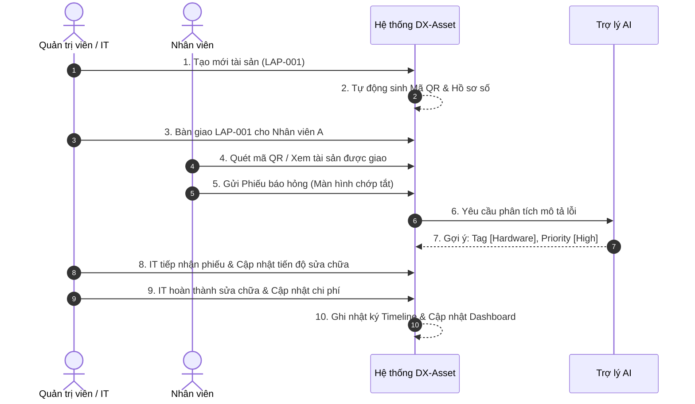
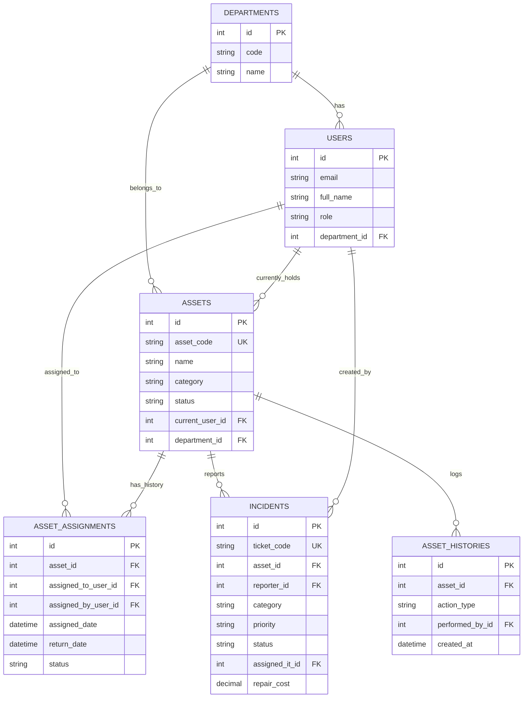

# DESIGN.md - Tài liệu Thiết kế Kiến trúc DX-Asset

> **Dự án**: DX-Asset: Open-Source Digital Asset Lifecycle Management Platform  
> **Cuộc thi**: Phần mềm Nguồn mở OLP 2026 (Chủ đề DX-OS / DX-Lab)  
> **Đội ngũ phát triển**: Nhóm 3 sinh viên - Trường Đại học Thủ Dầu Một  

---

## 1. Product Vision (Tầm nhìn sản phẩm)

**DX-Asset** là nền tảng web mã nguồn mở quản lý tập trung toàn bộ vòng đời tài sản số và thiết bị nội bộ doanh nghiệp. Sản phẩm giúp chuyển đổi các quy trình quản lý thủ công rời rạc (Excel, giấy tờ, tin nhắn) thành một quy trình số hóa chuẩn hóa, minh bạch, có khả năng truy vết lịch sử hoàn chỉnh và tích hợp Trợ lý AI hỗ trợ ra quyết định theo khung kiến trúc **DX-OS**.

---

## 2. Problem Statement (Bài toán thực tế)

Trong nhiều doanh nghiệp (đặc biệt là khối doanh nghiệp vừa và nhỏ - SME), việc quản lý tài sản và thiết bị nội bộ (laptop, máy tính bàn, màn hình, máy in, router...) đang gặp các vấn đề lớn:

1. **Quản lý rời rạc**: Dữ liệu tài sản bị phân tán qua file Excel, tin nhắn chat hoặc sổ sách thủ công.
2. **Mất truy vết lịch sử**: Không biết chính xác thiết bị đang ở đâu, ai đang sử dụng, lịch sử bàn giao hay sửa chữa trước đây như thế nào.
3. **Quy trình báo hỏng chậm trễ**: Khi thiết bị gặp sự cố, nhân viên không biết báo cho ai, phiếu hỗ trợ không được theo dõi tiến độ rõ ràng.
4. **Thiếu báo cáo quản lý**: Cấp quản lý không có số liệu định lượng theo thời gian thực về tổng giá trị, tình trạng thiết bị hoặc chi phí bảo trì theo phòng ban.

**Giải pháp của DX-Asset**: Tạo lập **Hồ sơ số tài sản (QR Asset Passport)** tập trung, kết nối toàn bộ hoạt động Cấp phát $\rightarrow$ Thu hồi $\rightarrow$ Báo hỏng $\rightarrow$ Bảo trì thành một quy trình số thống nhất.

---

## 3. Target Users (Đối tượng sử dụng)

1. **Quản trị viên (Admin)**: Quản lý người dùng, phòng ban, phân quyền và cấu hình toàn hệ thống.
2. **Quản lý Tài sản / IT Staff (`IT_ASSET_MANAGER`)**: Quản lý danh mục tài sản, thực hiện bàn giao/thu hồi, tiếp nhận và xử lý phiếu báo hỏng sự cố.
3. **Nhân viên (`EMPLOYEE`)**: Quản lý tài sản được giao, quét mã QR tra cứu thông tin, gửi phiếu báo hỏng sự cố.
4. **Cấp Quản lý (`MANAGER`)**: Giám sát báo cáo thống kê tình trạng tài sản và chỉ số vận hành trên Dashboard.

---

## 4. Main Use Case (Các trường hợp sử dụng chính)

- **Quản lý Định danh Tài sản**: Thêm mới, chỉnh sửa, vô hiệu hóa tài sản và tự động tạo mã QR định danh duy nhất.
- **Bàn giao & Thu hồi**: Bàn giao tài sản cho nhân viên/phòng ban, ghi nhận ngày bàn giao, ngày thu hồi và lưu vết lịch sử không ghi đè.
- **Báo hỏng & Xử lý Bảo trì**: Nhân viên gửi ticket sự cố $\rightarrow$ AI gợi ý phân loại/độ ưu tiên $\rightarrow$ IT tiếp nhận, xử lý và đóng ticket.
- **Tra cứu QR Code**: Quét mã QR trên thiết bị để mở nhanh Hồ sơ tài sản (Asset Passport).
- **Giám sát Dashboard**: Xem biểu đồ tỷ lệ tài sản theo trạng thái, phòng ban và chi phí bảo trì.

---

## 5. Main Demo Workflow (Luồng trình diễn chính - 10 bước)



---

## 6. MVP Features (Các chức năng thuộc phạm vi MVP)

1. **Xác thực & Phân quyền (Auth & RBAC)**: Đăng nhập JWT, phân quyền 4 vai trò (`ADMIN`, `IT_ASSET_MANAGER`, `EMPLOYEE`, `MANAGER`).
2. **Quản lý Tài sản (Asset Management)**: CRUD tài sản, phân loại category, lọc/tìm kiếm, tự động sinh mã QR.
3. **Bàn giao & Thu hồi (Assignment & Return)**: Bàn giao thiết bị cho nhân viên, thu hồi về kho, lưu lịch sử sở hữu.
4. **Báo hỏng & Quản lý Bảo trì (Incidents & Maintenance)**: Tạo ticket báo hỏng, IT tiếp nhận/chuyển trạng thái (`OPEN` $\rightarrow$ `IN_PROGRESS` $\rightarrow$ `RESOLVED`), lưu chi phí sửa chữa.
5. **QR Asset Passport**: Quét/mở mã QR để xem thông tin thiết bị và thực hiện thao tác nhanh.
6. **Lịch sử Tài sản (Asset Timeline Log)**: Lưu vết toàn bộ biến động của tài sản (không xóa dữ liệu cũ).
7. **Dashboard Thống kê**: Hiển thị tổng số tài sản, số lượng theo trạng thái, phòng ban và danh sách sự cố gần đây.
8. **AI Assistant**: Trợ lý AI gợi ý phân loại sự cố (Category) và độ ưu tiên (Priority) từ mô tả báo hỏng.

---

## 7. Features Excluded from MVP (Các tính năng CẮT BỎ khỏi MVP)

Để đảm bảo khả thi cho nhóm 3 sinh viên, các tính năng sau **tuyệt đối không triển khai** trong MVP:

- ❌ Hệ thống ERP toàn diện (Kế toán, Mua hàng, Lương thưởng).
- ❌ Tính toán khấu hao kế toán tài sản phức tạp.
- ❌ Quản lý nhà cung cấp (Vendor) và quy trình mua sắm (Procurement).
- ❌ Tích hợp thiết bị phần cứng IoT hoặc GPS Tracking.
- ❌ Nhận diện khuôn mặt hoặc sinh trắc học.
- ❌ Xây dựng ứng dụng Mobile Native (chỉ làm Web Responsive).
- ❌ AI tự động thực thi hành động không có con người kiểm duyệt (tự duyệt mua, tự thanh lý).
- ❌ Kiến trúc Microservices phức tạp (chỉ dùng kiến trúc Monolith tinh gọn).

---

## 8. User Roles and Permissions (Vai trò và Phân quyền)

| Chức năng | ADMIN | IT_ASSET_MANAGER | EMPLOYEE | MANAGER |
| :--- | :---: | :---: | :---: | :---: |
| Quản lý Người dùng & Phòng ban | ✅ | ❌ | ❌ | ❌ |
| Tạo / Sửa / Vô hiệu hóa Tài sản | ✅ | ✅ | ❌ | ❌ |
| Bàn giao / Thu hồi Tài sản | ✅ | ✅ | ❌ | ❌ |
| Quét QR xem Hồ sơ Tài sản | ✅ | ✅ | ✅ | ✅ |
| Xem Tài sản được giao cho mình | ✅ | ✅ | ✅ | ✅ |
| Gửi Phiếu báo hỏng (Create Ticket) | ✅ | ✅ | ✅ | ❌ |
| Tiếp nhận & Xử lý Bảo trì (IT) | ✅ | ✅ | ❌ | ❌ |
| Xem Dashboard Thống kê | ✅ | ✅ | ❌ | ✅ |

---

## 9. Database Entities (Các thực thể CSDL)

1. **`users`**: Người dùng trong hệ thống (id, email, password_hash, full_name, role, department_id, is_active, created_at, updated_at).
2. **`departments`**: Phòng ban doanh nghiệp (id, code, name, description, created_at, updated_at).
3. **`assets`**: Thông tin tài sản (id, asset_code, name, category, brand, model, serial_number, status, purchase_date, warranty_expiry, current_user_id, department_id, location, description, qr_code_url, created_at, updated_at).
4. **`asset_assignments`**: Nhãn lịch sử bàn giao (id, asset_id, assigned_to_user_id, assigned_by_user_id, assigned_date, return_date, status, notes, created_at).
5. **`incidents`**: Phiếu báo hỏng/sự cố (id, ticket_code, asset_id, reporter_id, title, description, category, priority, status, assigned_it_id, resolution_notes, repair_cost, created_at, updated_at, resolved_at).
6. **`asset_histories`**: Nhật ký biến động tài sản (id, asset_id, action_type, performed_by_id, details, created_at).

---

## 10. Database Relationships (Mối quan hệ giữa các thực thể)

- `departments` (1) $\rightarrow$ ($\infty$) `users`: Một phòng ban chứa nhiều người dùng.
- `departments` (1) $\rightarrow$ ($\infty$) `assets`: Một phòng ban quản lý nhiều tài sản.
- `users` (1) $\rightarrow$ ($\infty$) `assets`: Một người dùng hiện tại đang giữ nhiều tài sản.
- `assets` (1) $\rightarrow$ ($\infty$) `asset_assignments`: Một tài sản có nhiều lượt bàn giao/thu hồi theo thời gian.
- `users` (1) $\rightarrow$ ($\infty$) `asset_assignments`: Người dùng nhận (`assigned_to`) hoặc người thực hiện (`assigned_by`).
- `assets` (1) $\rightarrow$ ($\infty$) `incidents`: Một tài sản có thể phát sinh nhiều phiếu báo hỏng.
- `users` (1) $\rightarrow$ ($\infty$) `incidents`: Người báo hỏng (`reporter`) và IT xử lý (`assigned_it`).
- `assets` (1) $\rightarrow$ ($\infty$) `asset_histories`: Một tài sản có chuỗi lịch sử nhật ký sự kiện.

---

## 11. ERD (Entity Relationship Diagram bằng Mermaid)



---

## 12. Frontend Pages (Cấu trúc màn hình Giao diện)

- `/login`: Đăng nhập hệ thống.
- `/dashboard`: Bảng điều khiển thời gian thực (Tổng tài sản, biểu đồ trạng thái, incident mở).
- `/assets`: Danh sách tài sản (Tìm kiếm, bộ lọc trạng thái/phòng ban, nút Thêm mới).
- `/assets/[id]`: Chi tiết Hồ sơ số tài sản (QR Passport), thông tin kỹ thuật, timeline lịch sử.
- `/assets/new` & `/assets/[id]/edit`: Màn hình tạo mới và chỉnh sửa tài sản.
- `/assignments`: Quản lý danh sách bàn giao và thao tác Thu hồi tài sản.
- `/incidents`: Danh sách phiếu báo hỏng (Phân loại theo trạng thái `OPEN`, `IN_PROGRESS`, `RESOLVED`).
- `/incidents/new`: Màn hình gửi báo hỏng cho Nhân viên (tích hợp nút "AI gợi ý phân loại").
- `/incidents/[id]`: Chi tiết sự cố & Giao diện xử lý cho IT Staff.
- `/users` & `/departments`: Quản lý danh sách người dùng và phòng ban (Dành cho Admin).

---

## 13. Backend API Groups (Danh sách Nhóm API)

- **Auth Group (`/api/v1/auth`)**:
  - `POST /login`: Đăng nhập lấy Token JWT.
  - `GET /me`: Lấy thông tin người dùng hiện tại.
- **Assets Group (`/api/v1/assets`)**:
  - `GET /`: Danh sách tài sản (hỗ trợ search, filter, pagination).
  - `POST /`: Tạo tài sản mới.
  - `GET /{id}`: Lấy chi tiết tài sản & QR code metadata.
  - `PUT /{id}`: Chỉnh sửa tài sản.
  - `DELETE /{id}`: Vô hiệu hóa tài sản.
- **Assignments Group (`/api/v1/assignments`)**:
  - `POST /assign`: Thao tác bàn giao tài sản.
  - `POST /return`: Thao tác thu hồi tài sản.
  - `GET /history/{asset_id}`: Lịch sử bàn giao của 1 tài sản.
- **Incidents Group (`/api/v1/incidents`)**:
  - `GET /`: Danh sách phiếu báo hỏng.
  - `POST /`: Tạo phiếu báo hỏng mới.
  - `PUT /{id}/status`: IT cập nhật trạng thái phiếu.
  - `PUT /{id}/resolve`: Hoàn thành sửa chữa (nhập nguyên nhân & chi phí).
- **Dashboard Group (`/api/v1/dashboard`)**:
  - `GET /stats`: Chỉ số tổng quan (Số lượng tài sản, sự cố, phòng ban).
- **AI Service Group (`/api/v1/ai`)**:
  - `POST /suggest-incident-meta`: Gửi đoạn mô tả lỗi $\rightarrow$ Trả về phân loại đề xuất (Category, Priority, Reasoning).

---

## 14. AI Feature Proposal (Đề xuất tính năng AI)

- **Tên chức năng**: *AI Smart Incident Classifier & Priority Suggester (Trợ lý Phân loại Sự cố).*
- **Cách hoạt động**:
  1. Khi nhân viên nhập tiêu đề & mô tả lỗi (vd: *"Laptop bị màn hình xanh liên tục khi mở Photoshop"*).
  2. Nhân viên bấm *"AI Gợi ý Phân loại"*.
  3. API Backend gửi prompt ngắn đến LLM (Open-source LLM / Ollama local / External API fallback).
  4. AI trả về JSON:
     ```json
     {
       "suggested_category": "SOFTWARE",
       "suggested_priority": "MEDIUM",
       "explanation": "Lỗi xanh màn hình khi chạy ứng dụng đồ họa thường liên quan đến driver GPU hoặc tràn RAM."
     }
     ```
  5. Giao diện tự điền gợi ý vào các ô lựa chọn. Nhân viên có thể giữ nguyên hoặc điều chỉnh lại trước khi gửi.
- **Tuân thủ nguyên tắc Human-in-the-loop**: AI **chỉ đưa ra gợi ý**, người dùng hoàn toàn chủ động duyệt/thay đổi thông tin trước khi lưu chính thức vào cơ sở dữ liệu.

---

## 15. Mapping to H-P-D-I (Ánh xạ Kiến trúc DX-OS)

- **[H] Human**: Hệ thống quản lý người dùng 4 vai trò rõ ràng, phân quyền màn hình và chức năng qua JWT Middleware.
- **[P] Process**: Quy trình Cấp phát $\rightarrow$ Báo hỏng $\rightarrow$ Sửa chữa $\rightarrow$ Thu hồi khép kín, cài đặt ràng buộc trạng thái tài sản hợp lệ (**Poka-yoke**).
- **[D] Data**: Cơ sở dữ liệu PostgreSQL chuẩn hóa, nhật ký biến động lịch sử (Timeline) không ghi đè, Dashboard báo cáo thời gian thực.
- **[I] Intelligence**: Trợ lý AI phân tích ngôn ngữ tự nhiên để gợi ý phân loại sự cố và độ ưu tiên.

---

## 16. Suggested Technology Stack (Định hướng Công nghệ)

- **Frontend**: Next.js (App Router), TypeScript, Tailwind CSS, `shadcn/ui`, `lucide-react`, `html5-qrcode`.
- **Backend**: FastAPI (Python 3.12), Pydantic v2, SQLAlchemy 2.0 / SQLModel, `python-jose` (JWT), `passlib` (Bcrypt).
- **Database**: PostgreSQL 16 (Hỗ trợ SQLite cho môi trường Dev siêu nhẹ).
- **AI Framework**: Framework mã nguồn mở kết nối LLM (LangChain / Ollama / OpenAI-compatible API).
- **DevOps & Infrastructure**: Docker, Docker Compose, GitHub Actions (CI/CD).
- **Documentation**: Markdown, OpenAPI / Swagger (tự động từ FastAPI).

---

## 17. Project Folder Structure (Cấu trúc thư mục dự án)

```text
dx-asset/
├── frontend/                # Mã nguồn Frontend (Next.js + TypeScript)
│   ├── src/
│   │   ├── app/             # Next.js App Router (pages)
│   │   ├── components/      # UI components (shadcn/ui)
│   │   ├── lib/             # API client, utils, constants
│   │   └── types/           # TypeScript interfaces
│   ├── Dockerfile
│   └── package.json
├── backend/                 # Mã nguồn Backend (FastAPI + Python)
│   ├── app/
│   │   ├── api/             # API routes controllers
│   │   ├── core/            # Config, security, database session
│   │   ├── models/          # DB models (SQLAlchemy)
│   │   ├── schemas/         # Pydantic validation schemas
│   │   └── services/        # Business logic & AI service
│   ├── Dockerfile
│   └── requirements.txt
├── database/                # Scripts khởi tạo DB & Seed data
│   └── init.sql
├── docs/                    # Tài liệu hướng dẫn & Kiến trúc
├── docker-compose.yml       # Cấu hình khởi chạy trọn gói hệ thống
├── README.md                # Tài liệu hướng dẫn chính
├── DESIGN.md                # Tài liệu thiết kế kiến trúc
├── AGENTS.md                # Quy chuẩn phát triển AI Agent
├── LICENSE                  # Giấy phép mã nguồn mở (MIT)
└── .env.example             # Mẫu biến môi trường
```

---

## 18. Development Phases (Các giai đoạn phát triển)

- **Phase 1: Project Initialization & Open-Source Compliance**: Thiết lập GitHub Repo public, cấp phép MIT, file `README.md`, `DESIGN.md`, `Dockerfile` skeleton.
- **Phase 2: Database & Core Auth**: Dựng Schema PostgreSQL, viết API Auth (Login/JWT) & Phân quyền RBAC.
- **Phase 3: Asset Management & QR Passport**: Viết CRUD Tài sản, tính năng tạo/xem mã QR Code định danh.
- **Phase 4: Assignment & Incident Workflow**: Viết logic Bàn giao/Thu hồi, Quy trình xử lý phiếu Báo hỏng và Nhật ký Timeline.
- **Phase 5: Dashboard & AI Integration**: Viết API Thống kê Dashboard và dịch vụ AI gợi ý phân loại sự cố.
- **Phase 6: Testing, Documentation & Release**: Kiểm thử môi trường Docker, nạp Seed Data mẫu, tạo bản Release v1.0.0 trên GitHub.

---

## 19. Risks and Solutions (Rủi ro & Giải pháp)

1. **Rủi ro Phức tạp hóa Auth/SSO**:
   - *Giải pháp*: Sử dụng JWT + Role-based Middleware đơn giản, rõ ràng, tập trung vào trải nghiệm MVP.
2. **Rủi ro phụ thuộc vào API AI bên ngoài khi Demo**:
   - *Giải pháp*: Xây dựng cơ chế **Fallback Rule-based** (dựa trên từ khóa trong mô tả lỗi) trong Backend nếu API AI gặp sự cố hoặc gián đoạn mạng.
3. **Rủi ro Lỗi môi trường khi Giám khảo / Người khác chạy thử**:
   - *Giải pháp*: Đóng gói trọn gói bằng `docker-compose.yml` (chạy 1 lệnh `docker compose up` là hoạt động ngay cả FE, BE, DB).
4. **Rủi ro Vi phạm tiêu chí PoF Nguồn mở**:
   - *Giải pháp*: Đảm bảo file `LICENSE` chuẩn MIT ở gốc repo, không hardcode API Key, có tài liệu hướng dẫn build from source chi tiết.

---
